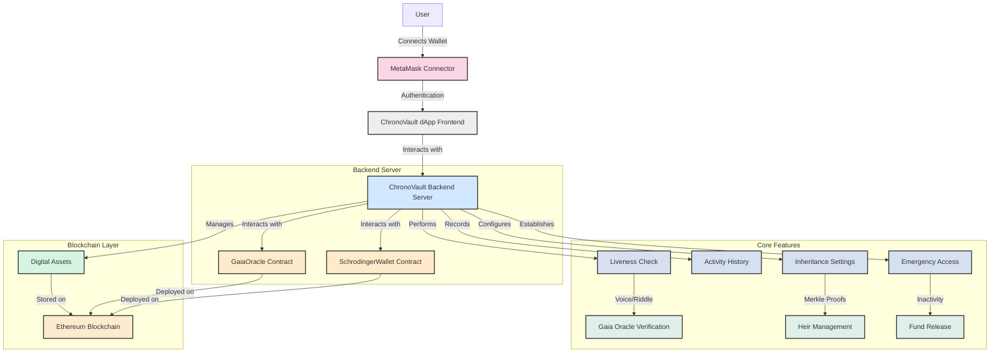

# ChronoVault - Secure Your Digital Legacy
ChronoVault is a decentralized application (dApp) that enables users to manage their digital assets through a blockchain-based inheritance solution. It provides a secure way to ensure your digital legacy can be passed on to your designated beneficiaries with advanced liveness verification and heir management.


## Features

- **MetaMask Integration**: Seamless wallet connection for secure blockchain interactions
- **Liveness Check**: Verify account activity via voice or riddle challenges using Gaia AI
- **Inheritance Management**: Define heirs with share allocation, verified via Merkle proofs
- **Activity Monitoring**: Track user activities (e.g., liveness checks) on-chain
- **Emergency Access**: Release funds to approved heirs after an inactivity period
- **Gaia Oracle Integration**: Secure off-chain verification of biometric (voice) and riddle-based liveness checks

## Architecture



## Component Structure

```mermaid
flowchart TD
    A[App] --> B[MetaMaskConnector]
    A --> C[Layout]
    C --> D[LivenessCheck]
    C --> E[InheritanceDashboard]
    C --> F[ActivityHistory]
    C --> G[EmergencyAccess]
    
    B --> H[Connect/Disconnect Wallet]
    D --> I[Voice/Riddle Verification]
    E --> J[Heir Management]
    F --> K[Activity Log]
    G --> L[Fund Release]
    
    subgraph "Frontend"
    A
    B
    C
    D
    E
    F
    G
    end
    
    subgraph "Backend"
    M[Express Server] --> N[Liveness Routes]
    M --> O[Riddle Routes]
    M --> P[LocalStorageManager]
    N --> Q[Handle Liveness Check]
    O --> R[Manage Riddles]
    P --> S[Persistent Storage]
    end
    
    subgraph "Smart Contracts"
    T[GaiaOracle] --> U[Verify Voice]
    T --> V[Verify Riddle]
    W[SchrodingerWallet] --> X[Prove Liveness]
    W --> Y[Manage Heirs]
    W --> Z[Track Activity]
    W --> AA[Release Funds]
    end
    
    M -->|Interacts with| T
    M -->|Interacts with| W
    
    style A fill:#f8f9fa,stroke:#333,stroke-width:1px
    style B fill:#e6f7ff,stroke:#333,stroke-width:1px
    style C fill:#f8f9fa,stroke:#333,stroke-width:1px
    style D fill:#e6fffb,stroke:#333,stroke-width:1px
    style E fill:#e6fffb,stroke:#333,stroke-width:1px
    style F fill:#e6fffb,stroke:#333,stroke-width:1px
    style G fill:#e6fffb,stroke:#333,stroke-width:1px
    style M fill:#d1e8ff,stroke:#333,stroke-width:1px
    style N fill:#e6f0fa,stroke:#333,stroke-width:1px
    style O fill:#e6f0fa,stroke:#333,stroke-width:1px
    style P fill:#e6f0fa,stroke:#333,stroke-width:1px
    style T fill:#ffebcc,stroke:#333,stroke-width:1px
    style U fill:#fff5e6,stroke:#333,stroke-width:1px
    style V fill:#fff5e6,stroke:#333,stroke-width:1px
    style W fill:#ffebcc,stroke:#333,stroke-width:1px
    style X fill:#fff5e6,stroke:#333,stroke-width:1px
    style Y fill:#fff5e6,stroke:#333,stroke-width:1px
    style Z fill:#fff5e6,stroke:#333,stroke-width:1px
    style AA fill:#fff5e6,stroke:#333,stroke-width:1px
```



## User Flow


## How can I edit this code?

There are several ways of editing your application.

### Use your preferred IDE

If you want to work locally using your own IDE, you can clone this repo and push changes. Pushed changes will also be reflected in Lovable.

The only requirement is having Node.js & npm installed - [install with nvm](https://github.com/nvm-sh/nvm#installing-and-updating)

Steps for Frontend:

```sh
# Step 1: Clone the repository using the project's Git URL.
git clone <YOUR_GIT_URL>

# Step 2: Navigate to the project directory.
cd <YOUR_PROJECT_NAME>

# Step 3: Install the necessary dependencies.
npm i

# Step 4: Start the development server with auto-reloading and an instant preview.
npm run dev
```

Steps for Backend:

```sh
# Step 1: Navigate to the backend directory (assumed to be in the same repo).
cd <YOUR_PROJECT_NAME>/server

# Step 2: Install the necessary dependencies.
npm i

# Step 3: Start the backend server.
npm start
# or
nodemon src/index.ts
```

Steps for Smart Contracts:

```sh
# Step 1: Navigate to the contracts directory (assumed to be in the same repo).
cd <YOUR_PROJECT_NAME>/contracts


# Step 3: Compile the smart contracts.
npx hardhat node

# Step 4: Deploy the smart contracts to a local network or testnet.
npx hardhat run scripts/deploy.cjs --network local
# Start a local Hardhat node if needed: npx hardhat node
```

### Use GitHub Codespaces

- Navigate to the main page of your repository.
- Click on the "Code" button (green button) near the top right.
- Select the "Codespaces" tab.
- Click on "New codespace" to launch a new Codespace environment.
- Edit files directly within the Codespace and commit and push your changes once you're done.

## Technologies Used

Frontend:

- **Vite**: Modern front-end build tool
- **TypeScript**: JavaScript with syntax for types
- **React**: UI library for building user interfaces
- **shadcn-ui**: UI component system based on Radix UI
- **Tailwind CSS**: Utility-first CSS framework
- **MetaMask SDK**: For wallet integration
- **React Router DOM**: For navigation
- **Lucide React**: Icon components
- **Lucide React**: Icon components
- **Axios**: For making HTTP requests to the backend

Backend:

- **Node.js**: JavaScript runtime for the server
- **Express**: Web framework for Node.js
- **TypeScript**: For type-safe backend development
- **Axios**: For making HTTP requests (if needed for external APIs)
- **LocalStorageManager**: Custom module for persistent storage (used as a simple database for demo purposes)

Smart Contracts:
- **Solidity**: Programming language for writing Ethereum smart contracts
- **Hardhat**: Development environment for compiling, deploying, and testing smart contracts
- **Ethers.js**: Library for interacting with the Ethereum blockchain (used in both backend and frontend)
- **Ethereum Blockchain**: The blockchain network where smart contracts are deployed
- **OpenZeppelin Contracts**: Used in SchrodingerWallet for Ownable and MerkleProof utilities


## Notes on Smart Contract
### GaiaOracle.sol
**Purpose**: Acts as an oracle for off-chain liveness verification, integrating with SchrodingerWallet to prove user liveness via voice or riddle challenges.
#### Key Functions:
- **createRiddle**: Stores a hashed riddle answer for verification.
- **verifyVoiceAndProveLiveness**: Verifies voice biometrics and proves liveness.
- **verifyRiddleAndProveLiveness**: Verifies riddle answers and proves liveness.
- **Access Control**: Restricted to an admin via the onlyAdmin modifier.
### SchrodingerWallet.sol
**Purpose**: Manages user funds, liveness activities, heir assignments, and fund release mechanisms.
#### Key Features:
- Liveness tracking with proveLivenessViaVoice and proveLivenessViaRiddle.
- Heir management with Merkle proof verification (addHeir, approveHeir).
- Activity logging (_recordActivity).
- Fund release to heirs after an inactivity period (releaseToHeirs).
**Access Control**: Uses onlyOwner for sensitive operations and onlyGaia for liveness proofs.